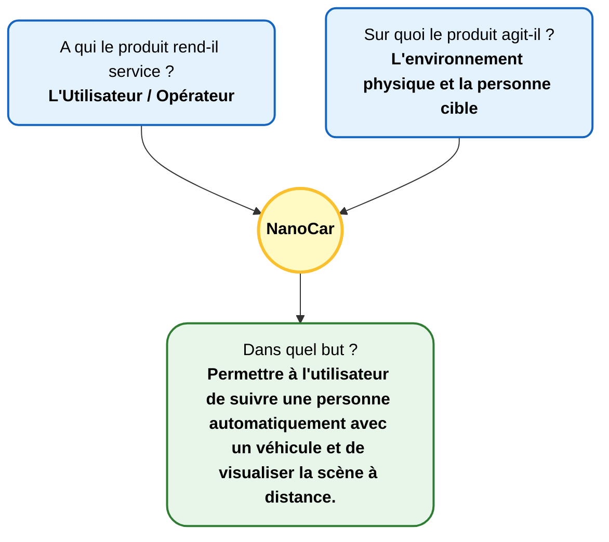

```mermaid
graph
    %% Définition des nœuds
    User[A qui le produit rend-il service ?<br/><b>L'Utilisateur / Opérateur</b>]
    Target[Sur quoi le produit agit-il ?<br/><b>L'environnement physique et la personne cible</b>]
    Product((<b>NanoCar</b>))
    Function[Dans quel but ?<br/><b>Permettre à l'utilisateur de suivre une personne automatiquement avec un véhicule et de visualiser la scène à distance.</b>]

    %% Définition des liens
    User --> Product
    Target --> Product
    Product --> Function 

    %% Styles pour ressembler à un bête à cornes classique
    style User fill:#E3F2FD,stroke:#1565C0,stroke-width:2px,rx:10,ry:10,color:#000
    style Target fill:#E3F2FD,stroke:#1565C0,stroke-width:2px,rx:10,ry:10,color:#000
    style Product fill:#FFF9C4,stroke:#FBC02D,stroke-width:3px,color:#000,font-size:16px
    style Function fill:#E8F5E9,stroke:#2E7D32,stroke-width:2px,rx:20,ry:20,color:#000
```

