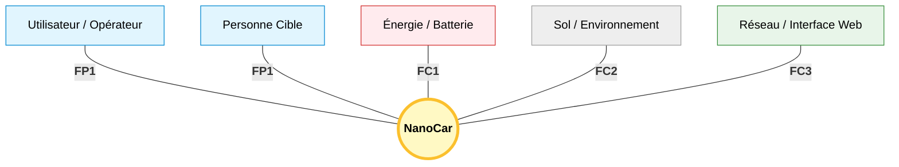

- FP1: Permettre à l'utilisateur de visualiser et de suivre automatiquement une cible.
- FC1: Être autonome en énergie pour alimenter la Jetson et les moteurs.
- FC2: Se déplacer sur le sol sans glisser et franchir de petits obstacles.
- FC3: Transmettre les données et recevoir les commandes via Wi-Fi (Serveur Web).

