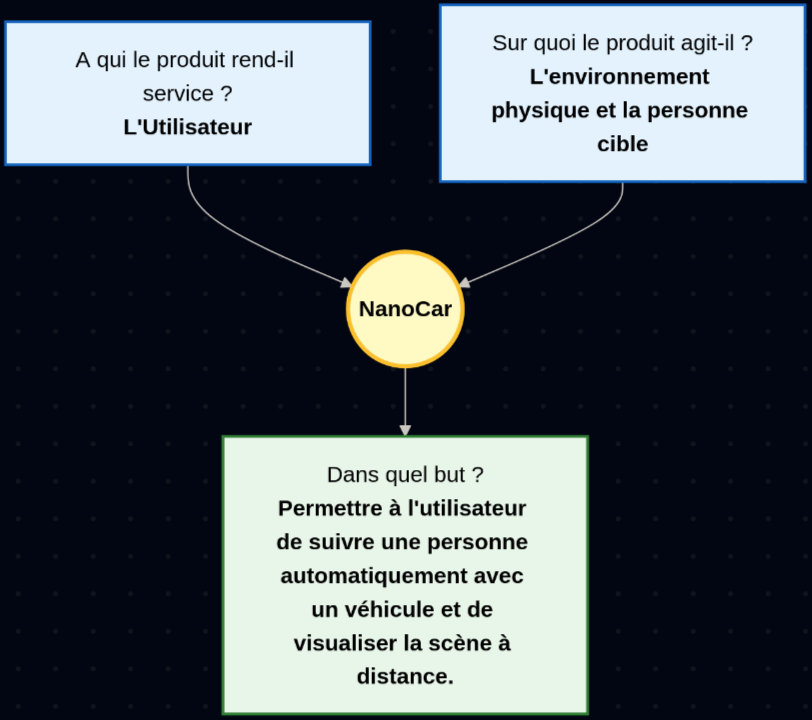

# Cahier des charges

## Sommaire

1. Contexte et objectifs du projet
2. Description fonctionnelle
3. Spécifications techniques
4. Contraintes du projet
5. Critères de validation
6. Planning prévisionnel
7. Documents annexes

## 1. Contexte et objectifs du projet

Ce projet rentre dans l'option prototypage qui demande une réalisation comprenant modélisation 3D et programmation.
Le projet NanoCar doit permettre à un utilisateur de suivre une personne à distance à l'aide d'un véhicule motorisé.
L'objectif est de concevoir et réaliser un véhicule automatique pouvant suivre une personne. Ce véhicule devra être controlable par une interface web en mode automatique ou manuel avec un retour vidéo.

## 2. Description fonctionnelle

Fonction principal: Permettre à l'utilisateur de visualiser et de suivre automatiquement une cible.
Fonction secondaires: 
- Contrôle du véhicule à distance en mode manuel
- Enregistrer le flux vidéo

L'utilisateur cherche à suivre une cible à distance de manière automatisé.
L'utilisateur cherche à se filmer de manière automatisé.

L'interface devra être accessible sur le web pour éviter toutes installations à l'utilisateur. De préférence, cette interface sera responsive pour qu'elle puisse être utilisé sur n'importe quel device ayant accès à internet.

## 3. Spécifications techniques

Matériel:
|Nom|Référence|Quantité|
|-|-|-|
|Motor driver|sabertooth 2x25|1|
|DC motor|313 RPM HD Premium Planetary Gear Motor w/Encoder|2|
|Lipo battery|4s, 13.4V 4200mAh|1|
|Régulateur de courant|DFR0946|1|
|Planche en bois pour le chassis| |1|
|Roues| |3|
|Jetson Nano|Jetson Nano 4Gb|1|
|Raspberry Pi Camera|Pi Camera V2.1|1|
|USB Wifi Dongle| Adaptateur Wi-Fi TP-LINK Archer T2U Nano USB 2.0 600 MBit/s|1|

Le véhicule devra pouvoir suivre une cible pendant au moins 5 minutes à une vitesse de 5 km/h (vitesse moyenne de marche d'un humain), il devra pouvoir éviter les obstacles et retrouver sa cible.

## 4. Contraintes du projet

Le projet est financé par le CESI avec un budget maximum de 150 eur. Certains des matériaux (comme la caméra pi, les roues, le bois, ...) sont déjà présent au CESI et ne seront pas dédui de ce budget. La carte Jetson Nano sera fourni par mes soins et récupéré à la fin du projet.

Dans un premier temps, le chassis du véhicule sera fait à partir d'une planche en bois découpé à l'aide de la CNC.

Les commandes devront être effectué avant le mercredi 17 décembre pour prendre en compte le temps de traitement et de livraison de celles-ci.
Enfin, le projet devra être rendu le 30 janvier 2026, jour de la soutenance.
Un rapport contenant le cahier des charges ainsi qu'une documentation technique et utilisateur devra être rendu à la même date.

## 5. Critères de validation

Pour assurer le bon respect de ce cahier des charges, les tests suivants devront être validé :
- Le véhicule se déplace au moins à 3km/h
- Le véhicule peut se déplacer pendant au moins 5 minutes
- Le véhicule peut suivre une cible malgrès des obstacles sur son chemin
- Le véhicule doit être mise en fonctionnement par une personne ayant le manuel utilisateur
- Le véhicule doit être contrôlable en mode manuel par une personne non formé
- Le flux vidéo est fluide (>24.99 fps)

Pour suivre l'avancement du projet, plusieurs KPI peuvent être mis en place :
- Utilisation du budget (budget dépensé / budget total)
- Pourcentage des tâches du WBS terminées
- Nombres de systèmes individuels validés

Enfin, pour valider le projet, les indicateurs suivants seront utilisés :
- Latence <300ms entre le flux vidéos et la réalité
- Durée de fonctionnement >5min
- Vitesse >3km/h
- Un utilisateur qui n'a jamais utilisé le projet peut le mettre en fonctionnement en <10min

## 6. Planning prévisionnel

Les deadlines importantes sont :
- 17/12/2025: Fin des premières commandes
- 16/01/2026: Assemblage final
- 21/01/2026: Tests d'intégration
- 30/01/2026: Soutenance final

## 7. Documents annexes

