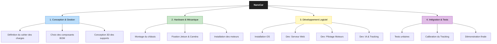

```mermaid

graph 
    %% Projet Racine
    Projet[<b>NanoCar</b>]

    %% Niveau 1 : Les grands lots
    Lot1[1. Conception & Gestion]
    Lot2[2. Hardware & Mécanique]
    Lot3[3. Développement Logiciel]
    Lot4[4. Intégration & Tests]

    %% Liens Niveau 1
    Projet --> Lot1
    Projet --> Lot2
    Projet --> Lot3
    Projet --> Lot4

    %% Niveau 2 : Détails Lot 1
    Lot1 --> L1T1[Définition du cahier des charges]
    Lot1 --> L1T2[Choix des composants <br/>BOM]
    Lot1 --> L1T3[Conception 3D des supports]

    %% Niveau 2 : Détails Lot 2
    Lot2 --> L2T1[Montage du châssis]
    Lot2 --> L2T2[Fixation Jetson & Caméra]
    Lot2 --> L2T3[Installation des moteurs]

    %% Niveau 2 : Détails Lot 3
    Lot3 --> L3T1[Installation OS]
    Lot3 --> L3T2[Dev: Serveur Web]
    Lot3 --> L3T3[Dev: Pilotage Moteurs]
    Lot3 --> L3T4[Dev: IA & Tracking]

    %% Niveau 2 : Détails Lot 4
    Lot4 --> L4T1[Tests unitaires]
    Lot4 --> L4T2[Calibration du Tracking]
    Lot4 --> L4T3[Démonstration finale]

    %% Styles
    style Projet fill:#212121,stroke:#000,stroke-width:2px,color:#fff
    style Lot1 fill:#BBDEFB,stroke:#1976D2,color:#000
    style Lot2 fill:#C8E6C9,stroke:#388E3C,color:#000
    style Lot3 fill:#FFF9C4,stroke:#FBC02D,color:#000
    style Lot4 fill:#E1BEE7,stroke:#8E24AA,color:#000
```
